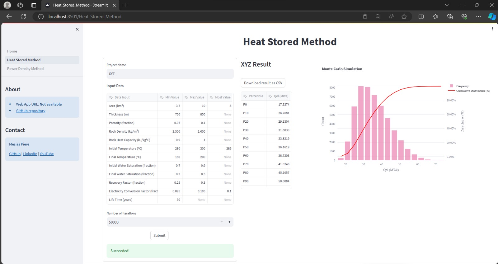
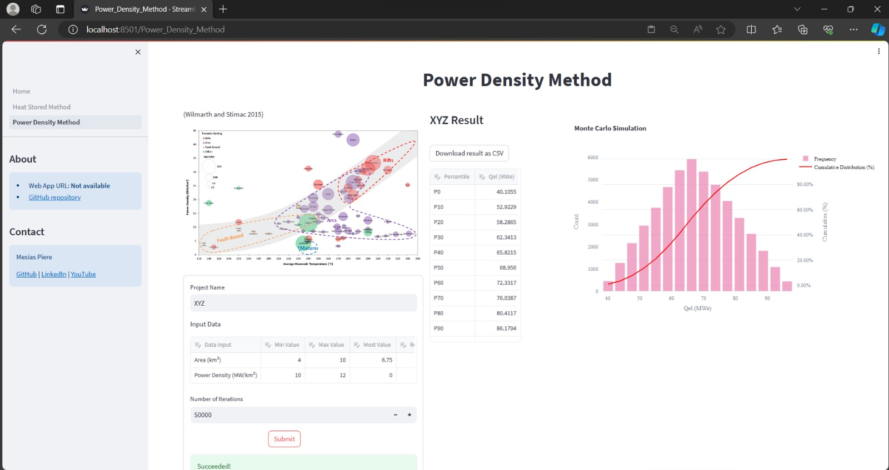

# Geothermal Resource Assessment Tools

[](https://www.python.org/downloads/)

Geothermal Resource Assessment Tools is a sophisticated tool designed for estimating the speculative potential of geothermal resources. It comes packaged with a modern and highly user-friendly Streamlit interface.

## Table of Contents
- [Usage](#usage)
  - [Cloning the GitHub Content](#cloning-the-github-content)
  - [Visiting the Website Version](#visiting-the-website-version)
- [Features](#features)
  - [Heat Stored Method](#heat-stored-method)
  - [Power Density Method](#power-density-method)
- [Acknowledgement](#acknowledgement)
- [Contributing](#contributing)
- [License](#license)
- [References](#references)

## Usage

You can utilize this tool either by cloning the GitHub content or by visiting the website version.

### Cloning the GitHub Content

Run the content as you would with any Streamlit project:

```bash
streamlit run Home.py
```

### Visiting the Website Version

Visit the website version by following [this link](https://geothermal-ra-mpc.herokuapp.com).

## Features

### Heat Stored Method

The Heat Stored Method allows users to estimate the amount of heat stored in a geothermal reservoir. This method provides valuable insights into the reservoir's thermal energy capacity.



### Power Density Method

The Power Density Method enables users to calculate the power density of a geothermal field. Power density is a crucial parameter for assessing the energy generation potential of a reservoir.



## Acknowledgement

This project extends its gratitude to the Geothermal Engineering Study Program at ITB.

## Contributing

Pull requests are welcome. For major changes, please open an issue first to discuss what you would like to change.

Please make sure to update tests as appropriate.

## License

This project is licensed under the [MIT License](https://choosealicense.com/licenses/mit/).

## References

Please refer to the following resources for additional information:

- [Streamlit Documentation](https://docs.streamlit.io/)
- [Geothermal Reservoir Engineering Second Edition (2011)](https://www.sciencedirect.com/book/9780123838803/geothermal-reservoir-engineering)
- [Power Density in Geothermal Fields](https://www.researchgate.net/publication/313903650_Power_Density_in_Geothermal_Fields)

Feel free to explore these references for a deeper understanding of geothermal resource assessment and the technologies used in this project.